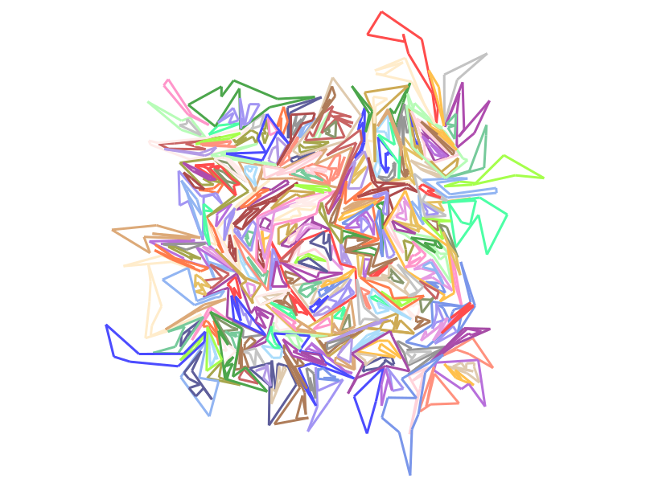

# Le projet d'algo 2023-2024

Bienvenue dans le projet d'algo 2023-2024.

Cette année, on s'intéresse à l'inclusion de polygones.

Le sujet n'est pas compliqué :

- on prend en entrée un ensemble de polygones simples
- on affiche sur la sortie standard quel polygone est inclus dans quel autre polygone

## Entrée

On récupère en entrée un ensemble de polygones à partir d'un fichier *.poly*.
Ce format de fichier texte est basé sur le principe suivant :

- chaque ligne est constituée de 3 éléments séparés par un ou plusieurs espaces : un entier, un flottant, un flottant
- les deux flottants forment les coordonnées *x* et *y* d'un point
- l'entier en début de ligne indique à quel polygone ce point est rajouté, en partant de 0
- l'ordre des lignes du fichier indique l'ordre des points des polygones
- les indices des polygones sont consécutifs (tous les points du polygone 0, puis tous les points du polygone 1, ...)

Au chargement, chaque fichier est converti en un vecteur de polygones.

À noter qu'il n'y a **jamais** d'intersection de segments entre deux polygones différents.
Au sein d'un même polygone seuls les segments consécutifs s'intersectent et uniquement à leurs
extrémités.

## Détection d'inclusion

Pour ce projet, on ne vous donne pas d'algorithme complet. Néanmoins, un des algorithmes de base qu'il vous faudra
implémenter consiste à détecter si un point est à l'intérieur d'un polygone. On peut y arriver en *partant* du point dans
une direction arbitraire et en comptant le nombre de segments du polygone traversés sur notre chemin. Si c'est impair le
point est à l'intérieur sinon à l'extérieur. Pour essayer d'éviter les problèmes liés aux erreurs d'arrondi et simplifier les calculs,
le mieux est d'avancer
verticalement ou horizontalement.

Pour plus d'info voir [wikipedia](https://en.wikipedia.org/wiki/Point_in_polygon)

## Sortie

En sortie on vous demande d'afficher sur la sortie standard le vecteur indiquant quel polygone est inclus (directement) dans quel autre polygone.
On identifie chaque polygone par son numéro. Comme tout polygone ne peut être inclus (directement) que dans au plus un autre
polygone, il suffit pour stocker la solution d'associer à chaque polygone l'indice de son père ou *-1* s'il n'en a aucun.
Le plus simple est alors de stocker cette information dans un vecteur tel que la ième case contient le père du ième polygone.

Par exemple le fichier *10x10.poly* fourni contient les deux polygones ci-dessous :

Le polygone 0 est affiché en rouge et le polygone 1 en vert. Comme le vert est inclus dans le rouge et que le rouge n'est inclus
dans personne la solution est le vecteur [-1, 0].

Afficher la solution consiste simplement à faire un *print* de ce vecteur ce qui est d'ailleurs déjà réalisé ligne 30
du fichier *main.py* fourni.

Second exemple, le fichier *e2.poly* suivant (0 est rouge, 1 est vert, 2 est bleu, 3 est violet):

a pour solution : [1, -1, 0, 0]
